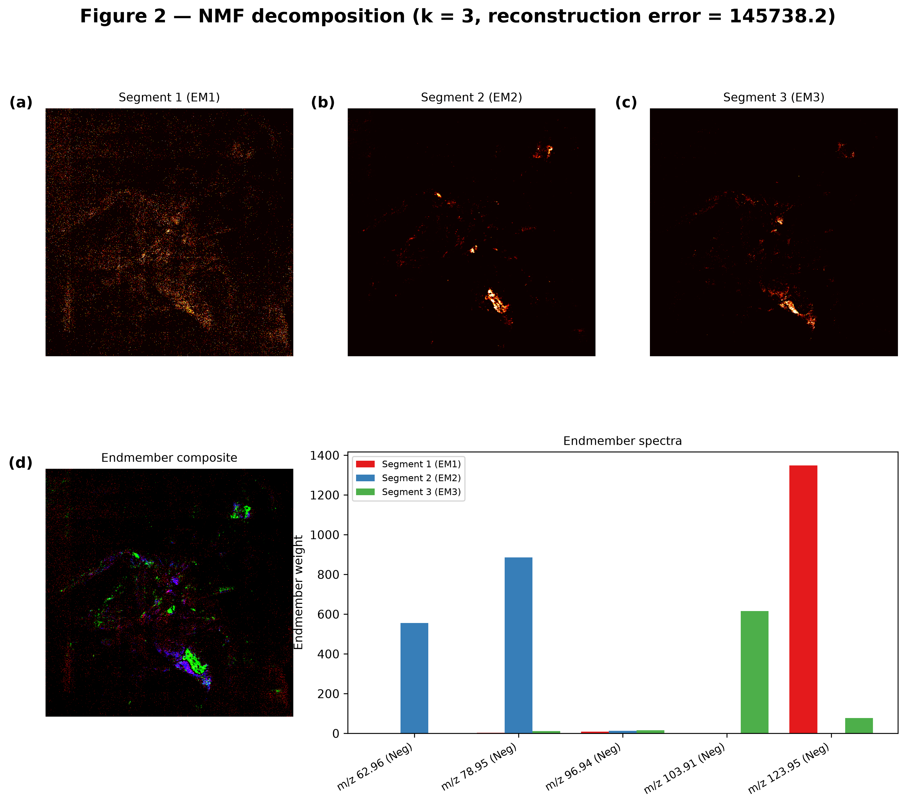
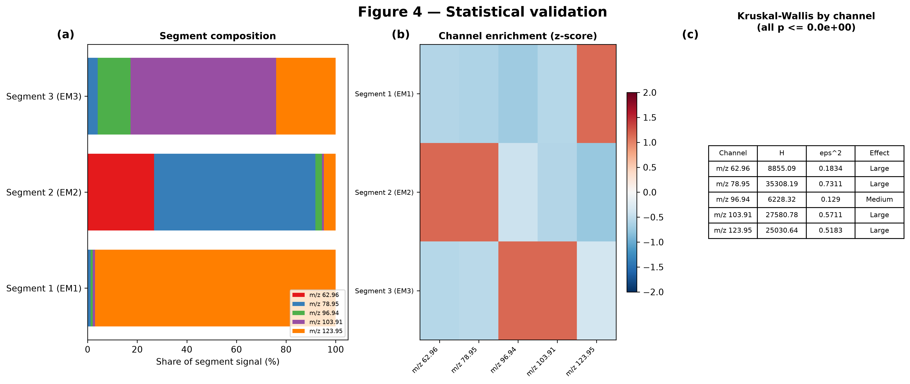

# ToF-SIMS Hyperspectral Analysis Pipeline

A reproducible Python pipeline for Time-of-Flight Secondary Ion Mass Spectrometry
(ToF-SIMS) hyperspectral imaging. It reads the instrument's non-standard BMP
exports, decomposes the ion-count cube into chemical endmembers, segments the
specimen spatially, and tests statistically whether those segments are real.

Developed on a fossilised fly specimen (*Fossil Fly*), but nothing in the code is
specific to it: the channel count, pixel grid, polarity grouping and number of
endmembers are all derived from the data or set in one config file.

---

## Quick start

```bash
git clone <your-repo-url>
cd tofsims-pipeline

python -m venv venv
source venv/bin/activate          # Windows: venv\Scripts\activate
pip install -r requirements.txt

# Runs the full pipeline end to end on generated test data:
pytest
```

Expect **24 passed, 11 skipped** — the skips are the regression tests that need the
original instrument data, which is not distributed (see
[Data availability](#data-availability)).

The measurement data underlying this study is withheld pending permission from the
analysing facility, so **the pipeline cannot be re-run on the fossil specimen from
this repository**. What you can do is run the complete pipeline on synthetic data
(the `pytest` command above), and inspect the committed result artefacts described
in [Data availability](#data-availability).

With your own ToF-SIMS data in place, the full six-stage run is:

```bash
python scripts/run_pipeline.py --raw-dir /path/to/your_data --output-dir results/your_run
```

## Results at a glance

NMF resolves the specimen into distinct chemical endmembers, which the segmentation
then maps spatially:



Every mass channel separates the segments at large effect size (peak
epsilon-squared 0.73, all p < 0.001):



The remaining report figures are in [`docs/figures/`](docs/figures/).

These figures are rendered images published as a record of the analysis. The arrays
behind them — the NMF decomposition in particular — are not distributed, so the
figures cannot be regenerated from this repository. See
[Data availability](#data-availability).

---

## Data availability

**No measurement values from the specimen are published in this repository, in any
form.** The following are withheld pending permission from the analysing facility:

| Withheld | Why |
|---|---|
| `Data/raw/*.bmp` | The instrument's native exports |
| `fossilfly_clean_stack.npz` | The decoded ion-count images |
| `02b_pca_components.npz` | Full-rank PCA: `scores @ loadings` inverts to the measurement matrix exactly |
| `02b_nmf_components.npz` | `W @ H` reconstructs raw ion counts (r = 0.978) |
| `01_summary_statistics.csv` | Direct per-channel min/max/mean/median/std |

The last three are excluded because a decomposition retaining every component is an
invertible rotation, not a summary: the fitted parameters are the measurements in
another basis. Any artefact from which per-pixel intensities can be recovered is
treated the same way as the raw exports.

What remains committed are classifications and test statistics — segment labels, a
foreground mask, a UMAP embedding, and the result tables. None of them contain or
permit recovery of ion-count values.

### Validating the pipeline

**The test suite is the primary means of validation, and it needs no withheld data:**

```bash
pytest
```

Expect **24 passed, 11 skipped**. The skips are the regression tests that require the
original dataset. Among the passes,
`tests/test_pipeline_end_to_end.py::TestUnseenDataset` builds a synthetic dataset
from scratch — a different pixel grid, channel count and naming scheme — and runs
all six stages over it with the stock config. That exercises the entire pipeline
end to end, independently of any withheld data.

### What a reader can and cannot check

**Cannot: re-run any stage of the fossil analysis.** Every stage needs data that is
not published. Verified against a fresh clone of this repository:

| Stage | Result | Missing |
|---|---|---|
| `overview` | fails | `fossilfly_clean_stack.npz` |
| `decompose` | fails | `fossilfly_clean_stack.npz` |
| `segment` | fails | `02b_nmf_components.npz` |
| `stats` | fails | `02b_nmf_components.npz` |
| `figures` | fails | `fossilfly_clean_stack.npz` |

**Can: read the reported results and check them for internal consistency.** These
all pass against a fresh clone:

| Check | Result |
|---|---|
| Segment sizes from `labels_dominant` | {32238, 8924, 7132} |
| Foreground pixel count from the mask | 48,294 |
| `seg_dominant` map agrees with labels scattered onto the mask | consistent |
| HDBSCAN noise fraction recomputed from labels vs `segmentation_metrics.csv` | agrees (value varies per run) |
| `n_pixels` in `04_statistical_results.csv` vs the mask | agrees |
| UMAP embedding row count vs the mask | agrees |

These confirm the published artefacts are mutually consistent and that the reported
figures were computed from the stated number of pixels. They do **not** re-derive
the statistics themselves, which would require the ion counts.

Generated PNGs are not committed (22 MB, regenerable from the source data); the
report figures used in the write-up are in [`docs/figures/`](docs/figures/).

### Substituting your own ToF-SIMS data

The committed artefacts describe *this* specimen, and the ion-count stack they were
derived from is not included. Analysing your own data therefore starts from the
`load` stage, which builds `fossilfly_clean_stack.npz` and `metadata.json` from your
files — the starting point for every downstream stage:

```bash
# Write to a separate directory to leave the committed artefacts intact:
python scripts/run_pipeline.py --raw-dir /path/to/your_data --output-dir results/your_run
```

Omit `--output-dir` and the run overwrites `Data/processed/` — fine, since
everything there is regenerable, but you lose the cached reference results.

Two things are worth checking on a first run with an unfamiliar instrument:

- **The export layout.** The reader assumes a 54-byte BMP header followed by
  interleaved `uint16` planes, taking plane 1 as the ion counts. Adjust
  `io.header_bytes` / `io.num_channels` / `io.channel_index` in
  [`configs/pipeline_config.yaml`](configs/pipeline_config.yaml) if yours differs.
  The `01_raw_overview.png` figure is the fastest check — your specimen should be
  visible in it.
- **The filename convention**, if you want acquisition metadata recovered. See
  [Processing your own data](#processing-your-own-data) below.

Everything else adapts on its own. See the next section for the full list of what
is inferred rather than configured.

---

## Processing your own data

This is the part most likely to matter to you. **In the common case you do not edit
any code** — you drop files in and run one command.

### 1. Put your `.bmp` exports somewhere

```bash
python scripts/run_pipeline.py --raw-dir /path/to/my_data --output-dir results/my_run
```

Or copy them into `data/raw/` and just run `python scripts/run_pipeline.py`.

### 2. That's usually it

The pipeline works out the rest by itself:

| Decision | How it is made |
|---|---|
| Which images form the analysis cube | The most common pixel grid in the dataset |
| Which polarity is the primary group | Whichever dominates that grid |
| Channel order | Sorted by m/z, so runs are reproducible |
| Number of NMF endmembers | The elbow of the reconstruction-error curve |
| Number of segments | Matches the endmember count |
| HDBSCAN `min_cluster_size` | Scaled to 2% of the foreground pixels |
| Images on a different grid | Treated as a secondary acquisition and resampled for the cross-polarity comparison |

A dataset with three channels at 96×128 and a different naming convention runs
through the same command unchanged — that case is covered by the test suite.

### 3. Adjust the config only if you need to

Everything lives in [`configs/pipeline_config.yaml`](configs/pipeline_config.yaml).
The settings you are most likely to touch:

```yaml
io:
  num_channels: 4        # interleaved planes in the export
  channel_index: 1       # which plane holds the ion counts
  header_bytes: 54

metadata:
  fields:                # regex per field; a field that matches nothing becomes null
    polarity: '(?:^|[\s_\-])(neg(?:ative)?|pos(?:itive)?)(?:[\s_\-]|$)'
    mass: '(\d+\.?\d*\s*±\s*\d+\.?\d*\s*u)'

analysis:
  target_shape: auto     # or [640, 640] to pin it
  polarity: auto         # or "Neg" / "Pos"

decomposition:
  nmf:
    n_components: auto   # or a fixed integer
```

If your filenames follow a different convention, change the `metadata.fields`
regexes. Each field is matched independently, so an unusual filename loses only the
fields it genuinely lacks rather than failing the run.

---

## Stages

Each stage reads its inputs from disk and writes its outputs there, so any stage can
be re-run on its own after a config change.

```bash
python scripts/run_pipeline.py --stage decompose     # just re-run the decomposition
python scripts/run_pipeline.py --stage segment,stats # or several
python scripts/run_pipeline.py --list-stages
```

| Stage | Does | Key outputs | Runtime |
|---|---|---|---|
| `load` | Parses the BMP exports, recovers metadata | `fossilfly_clean_stack.npz`, `metadata.json`, `01_*.png` | ~20 s |
| `overview` | Channel composites and correlation structure | `02a_*.png` | ~25 s |
| `decompose` | PCA, NMF, UMAP | `02b_*.npz`, `02b_*.png` | ~3 min |
| `segment` | 4 segmentations + agreement metrics | `fossilfly_segments.npz`, `03_*.png` | ~90 s |
| `stats` | Kruskal-Wallis, Dunn's post-hoc, colocalization | `04_statistical_results.csv`, `04_*.png` | ~30 s |
| `figures` | Publication-style master figures | `05_fig*.png` | ~20 s |

None of the arrays in the "Key outputs" column are committed to this repository;
they are what a run produces on your own data. See
[Data availability](#data-availability) for what is published.

**A full run takes about 6 minutes** on a normal laptop (7 images, 640×640, ~48k
foreground pixels), producing 47 files. UMAP dominates that time — `--no-umap`
brings a complete run down to roughly 90 seconds at the cost of the UMAP and
HDBSCAN panels.

### Running the notebooks instead

The notebooks reproduce the same analysis interactively and **must be run in
order**, because each reads artefacts the previous one wrote:

```
notebooks/exploratory/01_data_loading.ipynb
notebooks/analysis/02a_clean_overview.ipynb
notebooks/analysis/02b_pca_nmf_umap.ipynb
notebooks/analysis/03_segmentation.ipynb
notebooks/analysis/04_statistical_validation.ipynb
notebooks/analysis/05_master_figures.ipynb
```

They are committed without stored outputs, to keep diffs readable. **A copy of each
notebook with all outputs and figures rendered inline is in
[`notebooks/executed/`](notebooks/executed/)** — open those to read the results
without running anything.

Useful flags:

```bash
--nmf-k 4        # override the endmember count
--no-umap        # skip UMAP and HDBSCAN (much faster)
--config path    # use a different config file
```

---

## Method notes

**Reading the files.** The exporter writes a standard 54-byte BMP header claiming 64
bits per pixel, then dumps interleaved `uint16` planes. PIL and OpenCV both refuse or
misread this, so [`src/preprocessing/load_images.py`](src/preprocessing/load_images.py)
parses the payload directly, taking the dimensions from the header rather than
assuming a fixed grid.

**Why three decompositions.** PCA gives variance structure but its signed components
are hard to read chemically. NMF is additive and non-negative, so each pixel is a sum
of endmember contributions — physically meaningful for ion counts. UMAP captures
non-linear structure the linear methods miss. They are run on a shared preprocessing
so the results are comparable pixel-for-pixel.

**Why four segmentations.** Unsupervised segment boundaries are a hypothesis. The
pipeline reports pairwise ARI/NMI between methods and cluster purity *against a
majority-class baseline*, rather than reporting a single partition as fact. On the
bundled dataset the Gaussian mixture corroborates the dominant-endmember partition
(ARI 0.6761) while K-Means on PCA scores does not (ARI 0.0744) — a real finding
about which feature spaces separate this chemistry, not a defect.

**How agreement is scored.** Each pair of methods is compared on the pixels *both*
methods actually assigned, computed per pair. The `n_pixels` column of
`03_cross_method_agreement.csv` records that basis explicitly for every row.

This matters because a single global mask would tie every comparison to the noise
set of whichever method produces one. HDBSCAN discards roughly half the foreground,
and that set moves between runs, so scoring all pairs against it made the
K-Means-vs-GMM and dominant-vs-GMM numbers drift even though neither method's
labels ever changed. Pairs that assign every pixel are now scored on the full
48,294-pixel foreground and are reproducible run to run.

**Seeding.** Every stochastic component — PCA, NMF, K-Means, the Gaussian mixture,
UMAP, and the figure subsampling — draws its seed from the single `random_seed`
entry at the top of `configs/pipeline_config.yaml`. No seed is hardcoded at a call
site, so changing that one value changes the whole pipeline consistently.

**Why non-parametric statistics.** Ion-count distributions are heavily zero-inflated
and non-normal, so Kruskal-Wallis is used per channel with Dunn's post-hoc and
multiple-comparison correction. With ~48,000 pixels almost any difference reaches
significance, so effect size (epsilon-squared) is reported alongside every p-value and
is what the interpretation rests on.

---

## Repository layout

```
├── configs/pipeline_config.yaml   # every tunable parameter
├── Data/
│   ├── raw/                       # instrument .bmp exports (NOT distributed)
│   └── processed/                 # labels, mask, metrics (committed); no measurements
├── src/
│   ├── config.py                  # config loading and path resolution
│   ├── pipeline.py                # stage orchestration
│   ├── preprocessing/             # BMP parsing, metadata, normalisation, I/O
│   ├── features/                  # channel selection, PCA/NMF/UMAP
│   ├── segmentation/              # clustering and agreement metrics
│   ├── stats/                     # significance testing, colocalization
│   ├── viz/                       # all figure generation
│   └── utils/                     # paths, constants, formatting
├── notebooks/                     # thin wrappers over src/, for exploration
│   └── executed/                  # same notebooks with outputs rendered inline
├── scripts/run_pipeline.py        # CLI entry point
├── tests/                         # unit + end-to-end regression tests
├── docs/figures/                  # report figures used in the write-up
└── docs/legacy/                   # superseded exploratory scripts, kept for reference
```

The notebooks call the same functions as the CLI, so they cannot drift from it.

---

## Tests

```bash
pytest                    # everything
pytest tests/test_units.py  # fast unit tests only
```

Two groups matter:

- **`TestBundledDatasetRegression`** pins the published numbers — 48,294 foreground
  pixels, NMF rank 3, reconstruction error 145738.2, peak effect size 0.731 — so an
  accidental change to the analysis is caught rather than silently absorbed.
- **`TestUnseenDataset`** builds a synthetic dataset with a different pixel grid,
  channel count and naming scheme, then runs the whole pipeline over it with the stock
  config. This is the test that backs the claim that someone else's data will work.

---

## Requirements

Python 3.9+ and the packages in [`requirements.txt`](requirements.txt): numpy, pandas,
scipy, matplotlib, scikit-learn (≥1.3, for `sklearn.cluster.HDBSCAN`),
scikit-posthocs, umap-learn, PyYAML, pytest.

UMAP is optional at runtime — if `umap-learn` is missing, the pipeline logs it and
skips the UMAP and HDBSCAN steps rather than failing.

---

## Known limitations

- **UMAP is not reproducible, even with a fixed seed, and HDBSCAN inherits that.**
  Two UMAP runs on identical input with the same `random_seed` produce different
  embeddings (max coordinate difference ~52). Forcing single-threaded execution
  (`NUMBA_NUM_THREADS=1`, `OMP_NUM_THREADS=1`, `PYTHONHASHSEED=0`) does not fix it;
  the non-determinism is in `pynndescent`'s approximate nearest-neighbour graph
  construction, which `random_state` does not fully control.

  HDBSCAN is deterministic on a fixed embedding, but it consumes the UMAP output,
  so its results vary too. Measured across three full runs from scratch:

  | Run | Silhouette | Clusters | Noise |
  |---|---|---|---|
  | 1 | 0.269263 | 5 | 50.98% |
  | 2 | 0.168891 | 6 | 52.27% |
  | 3 | 0.266272 | 8 | 44.62% |

  **HDBSCAN cluster counts, noise fractions and any HDBSCAN-involving ARI/NMI
  should not be cited as fixed values.** Report them as a range, or qualitatively.
  Everything else is exactly reproducible: across those same three runs,
  `04_statistical_results.csv`, `04_dunn_posthoc.csv`, `04_colocalization.csv` and
  `metadata.json` were byte-identical, and every non-HDBSCAN row of
  `03_cross_method_agreement.csv` and `segmentation_metrics.csv` was unchanged.
  `tests/test_pipeline_end_to_end.py::TestStochasticReproducibility` pins those
  stable values and deliberately excludes the HDBSCAN ones.

- Endmember ordering is not stable across datasets or NMF re-fits, so segments are
  labelled generically (`Segment 1 (EM1)`). Supply `channel_semantics.segment_labels`
  in the config to give them chemical names for a specific dataset.
- The secondary-polarity comparison uses the first secondary image when several are
  present.
- Chemical identity of a mass channel is not inferred; the optional
  `channel_semantics.masses` map is used for figure labels only.
